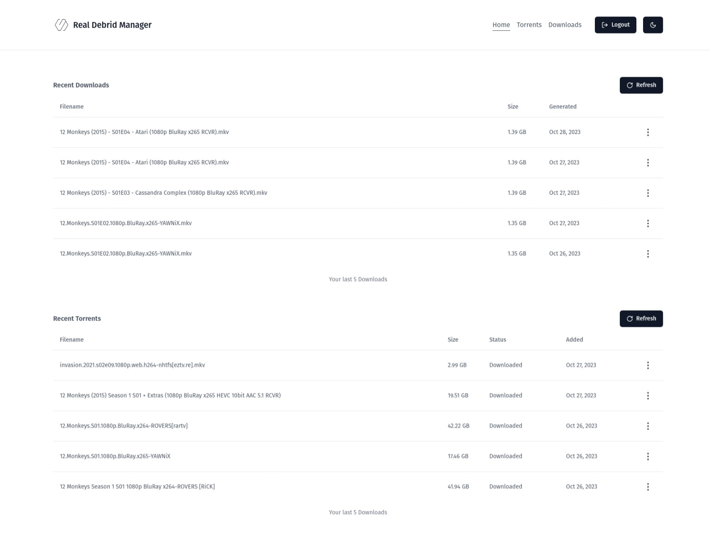

# Real Debrid Manager

Manage your Real Debrid downloads and torrents with ease.

Aim of this project is to provide a simple interface to manage and search through your Real Debrid downloads and torrents.

<figure>
    
    <figcaption>Dashboard Screenshot (This could be outdated)</figcaption>
</figure>

## Features

- View all your downloads and torrents
- Search through your downloads and torrents (the app loads all the user torrents and downloads and then filters them locally)
- Copy, delete, stream and get info on your downloads and torrents (Some of these features are not yet implemented)
- Add torrents through magnet links, hashes and imdb ids (Not yet implemented)
- Look for dead download links and refresh them (Not yet implemented)

## Environment Variables

To run this project, you will need to add the following environment variables to your .env file

```
PUBLIC_BASE_URI="https://api.real-debrid.com/rest/1.0"
PUBLIC_BASE_AUTH_URI="https://api.real-debrid.com"
PUBLIC_CLIENT_ID="X245A4XAIBGVM"
```

## Developing

Once you've created a project and installed dependencies with `npm install` (or `pnpm install` or `yarn`), start a development server:

```bash
npm run dev

# or start the server and open the app in a new browser tab
npm run dev -- --open
```
