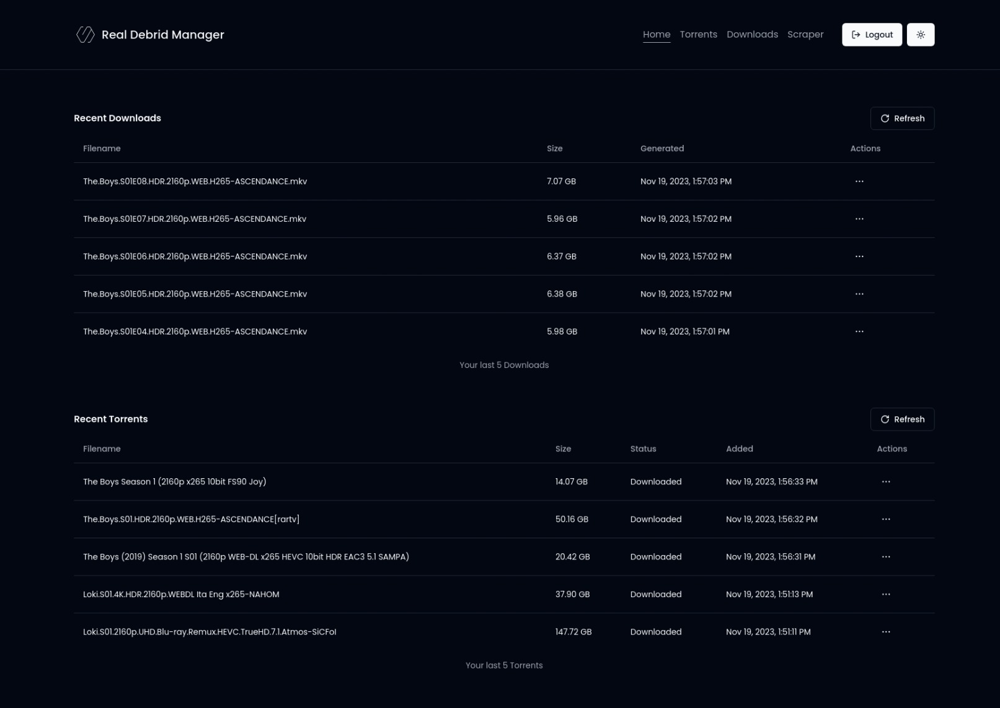
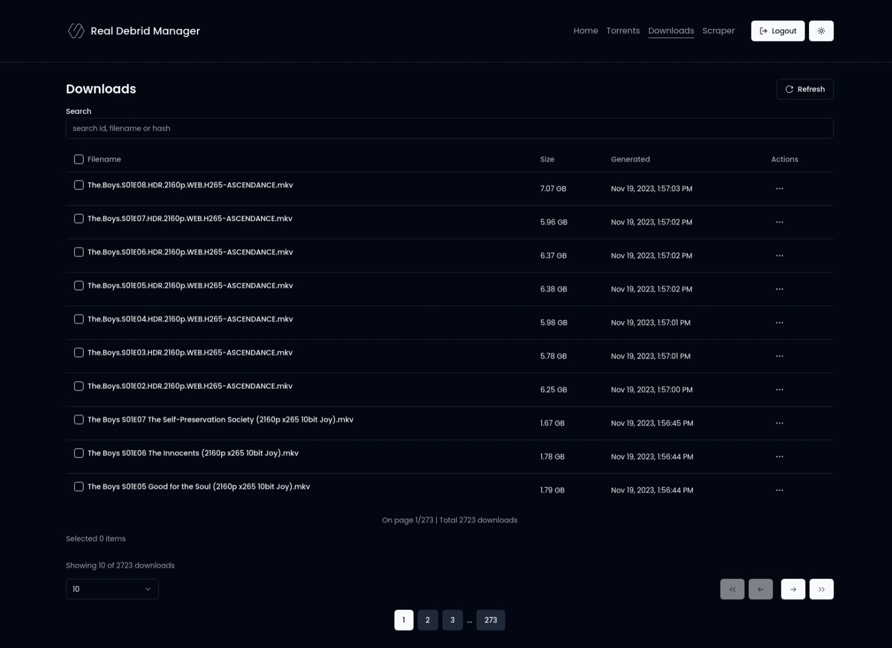
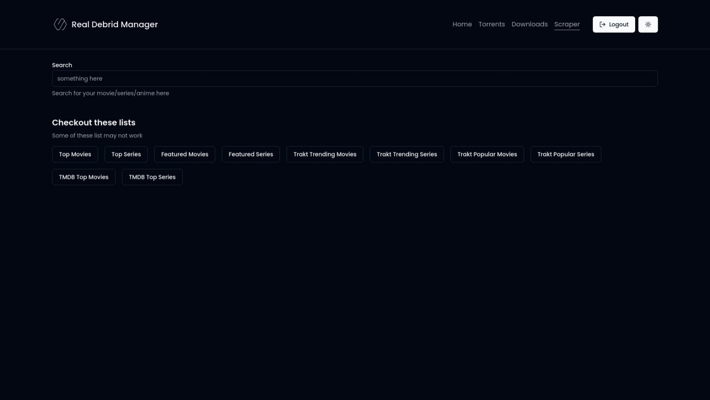
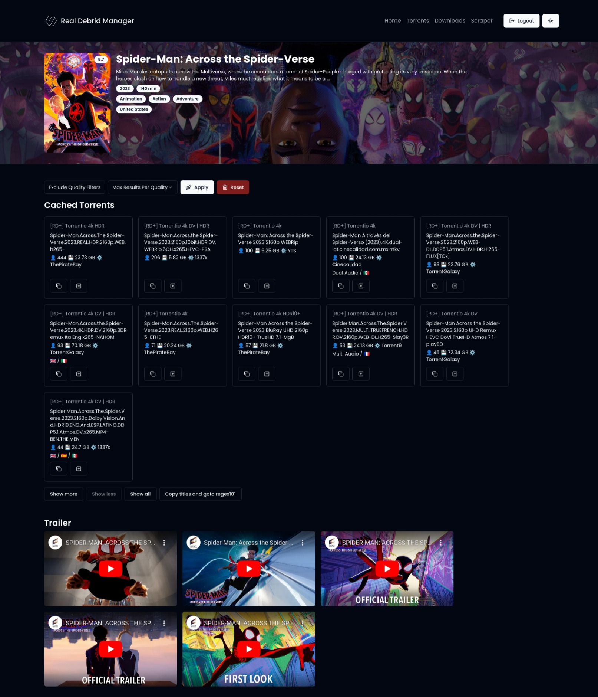
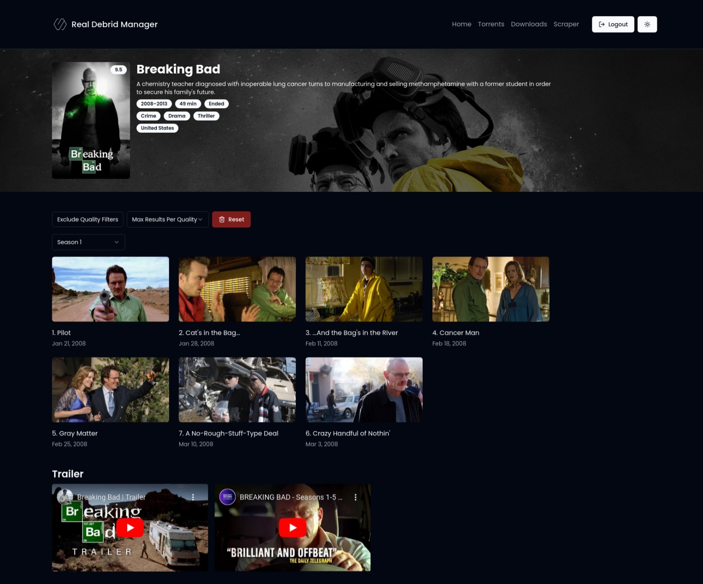

# Real Debrid Manager

Manage your Real Debrid downloads and torrents with ease.

Aim of this project is to provide a simple interface to manage and search through your Real Debrid downloads and torrents.

> These screenshots may not be up to date with the current version of the app.

</img>
</img>
</img>
</img>
</img>
</img>

https://github.com/AyushSehrawat/rdm/assets/69469790/315f615c-e567-4c51-a3e8-229830596f3c

## Features

- View and search through all your downloads and torrents
- Copy download links, delete, stream and get info on your downloads and torrents
- Bulk delete downloads and torrents
- Scraper to search for torrents and download links and add them to your Real Debrid.
- Add torrents through magnet links and torrent files (Not yet implemented)
- Look for dead download links and torrents and refresh them (Not yet implemented)

## Environment Variables

To run this project, you will need to add the following environment variables to your .env file. Just rename the .env.example file to .env.

```
PUBLIC_BASE_URI="https://api.real-debrid.com/rest/1.0"
PUBLIC_BASE_AUTH_URI="https://api.real-debrid.com"
PUBLIC_CLIENT_ID="X245A4XAIBGVM"
PUBLIC_TORRENTIO_BASE_URI="https://torrentio.strem.fun"
```

## Developing

Once you've created a project and installed dependencies with `npm install` (or `pnpm install` or `yarn`), start a development server:

```bash
npm run dev

# or start the server and open the app in a new browser tab
npm run dev -- --open
```
